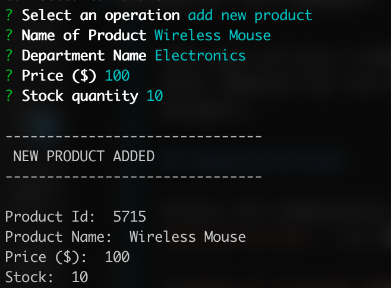

# Bamazon

### A Node CLI alternative to Amazon.

This app utilizes a MySQL database to store all inventory data. Bamazon has two separate interfaces for customers and managers. 

## bamazonCustomer

Access the *bamazonCustomer* interface, run `node bamazonCustomer` via the command line.

The customer is prompted if they would like to purchase a product. If they choose to purchase a product, the customer must provide the *Product Id* of the product to be purchased.

## bamazonManager

Access the *bamazonManager* interface, run `node bamazonManager` via the command line.

### View products for sale

### View low inventory

### Add to inventory

### Add new product

